# Japan Entry Flow Design Document

## Overview

The Japan Entry Flow feature provides a guided, user-friendly workflow for travelers preparing for Japan entry. Unlike Thailand's digital submission system, Japan requires manual completion of physical arrival cards and customs declarations. The system collects and validates travel information, then presents it in an easy-to-reference format for manual form filling at the airport.

## Architecture

### High-Level Flow

```mermaid
graph TD
    A[JapanTravelInfoScreen] -->|"查看入境指南" tapped| B[Preflight Validation]
    B -->|Validation passes| C[ResultScreen with Japan context]
    B -->|Validation fails| A
    C -->|Manual reference| D[Airport Form Completion]
    D -->|Complete| E[Immigration Process]
```



### System Integration Points

1. **Data Layer**: PassportDataService for unified data access
2. **Validation Layer**: Japan-specific validation logic
3. **Result Layer**: Enhanced ResultScreen with Japan-specific context and manual entry guidance
4. **Storage Layer**: SecureStorageService for persistent data storage

## Components and Interfaces

### 1. JapanTravelInfoScreen (New Component)

**Purpose**: Data collection screen for Japan-specific travel information with four collapsible sections.

**Props Interface**:
```javascript
interface JapanTravelInfoScreenProps {
  navigation: NavigationProp;
  route: {
    params: {
      passport: PassportData;
      destination: DestinationData;
    }
  };
}
```

**State Management**:
```javascript
interface JapanTravelInfoState {
  // Passport Information
  passportNo: string;
  fullName: string;
  nationality: string;
  dob: string;
  expiryDate: string;
  
  // Personal Information
  occupation: string;
  cityOfResidence: string;
  residentCountry: string;
  phoneCode: string;
  phoneNumber: string;
  email: string;
  gender: 'Male' | 'Female' | 'Undefined';
  
  // Fund Information
  funds: FundItem[];
  
  // Travel Information (Japan-specific)
  travelPurpose: 'Tourism' | 'Business' | 'Visiting Friends/Relatives' | 'Conference' | 'Other';
  customTravelPurpose: string;
  arrivalFlightNumber: string;
  arrivalDate: string;
  accommodationType: 'Hotel' | 'Ryokan' | 'Friend\'s House' | 'Airbnb' | 'Other';
  customAccommodationType: string;
  accommodationName: string;
  accommodationAddress: string;
  accommodationPhone: string;
  lengthOfStay: string; // in days
  
  // UI State
  expandedSection: 'passport' | 'personal' | 'funds' | 'travel' | null;
  errors: Record<string, string>;
  isLoading: boolean;
}
```

**Key Methods**:
- `getFieldCount(section)`: Calculates completion status for each section
- `isFormValid()`: Validates all required fields are complete
- `handleFieldBlur(fieldName, value)`: Validates and saves field data on blur
- `saveDataToSecureStorage()`: Persists all data to PassportDataService
- `handleContinue()`: Validates form and navigates to ResultScreen

### 2. JapanDataValidator (New Service)

**Purpose**: Centralized validation logic for Japan-specific data requirements.

```javascript
class JapanDataValidator {
  static validatePassportData(passport: Passport): ValidationResult;
  static validatePersonalInfo(personalInfo: PersonalInfo): ValidationResult;
  static validateFundItems(fundItems: FundItem[]): ValidationResult;
  static validateTravelInfo(travelInfo: TravelInfo): ValidationResult;
  static validateComplete(userId: string): Promise<CompleteValidationResult>;
}

interface ValidationResult {
  isValid: boolean;
  isComplete: boolean;
  errors: string[];
  fieldCount: { filled: number; total: number };
}
```

### 3. JapanTravelerContextBuilder (New Service)

**Purpose**: Builds complete traveler payload for manual entry guide from PassportDataService data.

```javascript
class JapanTravelerContextBuilder {
  static async buildContext(userId: string): Promise<JapanTravelerPayload>;
  static async validateContext(payload: JapanTravelerPayload): Promise<ValidationResult>;
}

interface JapanTravelerPayload {
  passport: PassportData;
  personalInfo: PersonalInfoData;
  travelInfo: JapanTravelInfoData;
  fundItems: FundItemData[];
  // Formatted for Japan's manual entry requirements
}
```

## Data Models

### Japan-Specific TravelInfo Extensions

```javascript
interface JapanTravelInfo extends TravelInfo {
  // Japan doesn't require departure flight info
  departureFlightNumber?: never;
  departureDepartureDate?: never;
  
  // Japan-specific fields
  accommodationPhone: string; // Required by Japan immigration
  lengthOfStay: string; // In days
  accommodationAddress: string; // Free-form text, no province selectors
}
```

### Validation Schema

```javascript
const JapanValidationSchema = {
  passport: {
    required: ['passportNo', 'fullName', 'nationality', 'dob', 'expiryDate'],
    validation: {
      passportNo: /^[A-Z0-9]{6,12}$/,
      expiryDate: (date) => new Date(date) > new Date(),
    }
  },
  personalInfo: {
    required: ['occupation', 'cityOfResidence', 'residentCountry', 'phoneNumber', 'email', 'gender'],
    validation: {
      email: /^[^\s@]+@[^\s@]+\.[^\s@]+$/,
      gender: ['Male', 'Female', 'Undefined'],
    }
  },
  travelInfo: {
    required: ['travelPurpose', 'arrivalFlightNumber', 'arrivalDate', 'accommodationType', 'accommodationName', 'accommodationAddress', 'accommodationPhone', 'lengthOfStay'],
    validation: {
      arrivalDate: (date) => new Date(date) > new Date(),
      lengthOfStay: (days) => parseInt(days) > 0,
      accommodationPhone: /^[\+]?[\d\s\-\(\)]{7,}$/,
    }
  },
  funds: {
    required: ['type', 'amount', 'currency'],
    minimum: 1,
    validation: {
      amount: (amount) => amount > 0,
    }
  }
};
```

## Error Handling

### Validation Error Display

```javascript
interface ValidationError {
  field: string;
  category: 'passport' | 'personalInfo' | 'travel' | 'funds';
  message: string;
  severity: 'error' | 'warning';
}

// Error display strategy
const ErrorDisplayStrategy = {
  blocking: ['missing_passport', 'invalid_dates', 'no_funds', 'missing_accommodation'],
  warning: ['arrival_too_early', 'expiry_soon'],
  inline: ['invalid_format', 'missing_optional']
};
```

### Progressive Data Entry

```javascript
// Allow progressive entry without blocking navigation
const ProgressiveValidation = {
  enableContinueButton: (fieldCounts) => {
    return Object.values(fieldCounts).every(count => 
      count.filled === count.total
    );
  },
  
  showFieldCountBadges: (section, fieldCount) => {
    const isComplete = fieldCount.filled === fieldCount.total;
    return {
      style: isComplete ? 'complete' : 'incomplete',
      text: `${fieldCount.filled}/${fieldCount.total}`,
      color: isComplete ? 'green' : 'yellow'
    };
  }
};
```

## Testing Strategy

### Unit Testing

1. **JapanDataValidator Tests**
   - Test Japan-specific validation rules
   - Test accommodation address validation (free-form)
   - Test phone number validation for accommodation
   - Test length of stay validation

2. **Field Count Calculation Tests**
   - Test passport section field counting
   - Test personal info section field counting
   - Test funds section field counting (minimum 1 item)
   - Test travel section field counting with Japan-specific fields

3. **Data Persistence Tests**
   - Test PassportDataService integration
   - Test data saving on field blur
   - Test data loading on screen focus
   - Test migration from legacy storage

### Integration Testing

1. **End-to-End Flow Tests**
   - Complete flow from JapanTravelInfoScreen to ResultScreen
   - Test progressive data entry
   - Test form validation and error display

2. **Data Consistency Tests**
   - Test data persistence across screen navigation
   - Test data recovery after app restart
   - Test concurrent user data handling

## UI/UX Design Specifications

### JapanTravelInfoScreen Layout

```
┌─────────────────────────────────────┐
│ ← 日本入境信息                      │
├─────────────────────────────────────┤
│                                     │
│ 🇯🇵 填写日本入境信息                │
│ 请提供以下信息以完成入境准备          │
│                                     │
│ 💾 所有信息仅保存在您的手机本地       │
│                                     │
│ ┌─────────────────────────────────┐ │
│ │ 护照信息                    5/5 │ │
│ │                             ▼  │ │
│ └─────────────────────────────────┘ │
│                                     │
│ ┌─────────────────────────────────┐ │
│ │ 个人信息                    6/7 │ │
│ │                             ▼  │ │
│ └─────────────────────────────────┘ │
│                                     │
│ ┌─────────────────────────────────┐ │
│ │ 资金证明                    1/1 │ │
│ │                             ▼  │ │
│ └─────────────────────────────────┘ │
│                                     │
│ ┌─────────────────────────────────┐ │
│ │ 旅行信息                    7/8 │ │
│ │                             ▼  │ │
│ └─────────────────────────────────┘ │
│                                     │
│ ┌─────────────────────────────────┐ │
│ │        查看入境指南             │ │
│ │      (Enabled when complete)    │ │
│ └─────────────────────────────────┘ │
└─────────────────────────────────────┘
```

### Collapsible Section Design

Each section includes:
- **Header**: Title with field count badge and expand/collapse icon
- **Content**: Form fields specific to that section
- **Field Count Badge**: Shows completion status (5/5 = green, 4/5 = yellow)
- **Progressive Disclosure**: Only one section expanded at a time

### Japan-Specific Field Differences

1. **No Visa Number Field**: Most visitors enter Japan visa-free
2. **No Departure Flight Info**: Not required for Japan's arrival card
3. **Free-form Address**: No province/district selectors, just text input
4. **Accommodation Phone**: Required field for Japan immigration
5. **Length of Stay**: Collected in days, not departure date

## Implementation Notes

### Navigation Integration

```javascript
// Update JapanTravelInfoScreen handleContinue
const handleContinue = async () => {
  if (!isFormValid()) {
    Alert.alert('Error', 'Please complete all required fields');
    return;
  }
  
  try {
    // Save all data before navigation
    await saveDataToSecureStorage();
    
    // Navigate to ResultScreen with Japan context
    navigation.navigate('ResultScreen', {
      userId: passport?.id || 'default_user',
      destination: 'japan',
      context: 'manual_entry_guide'
    });
  } catch (error) {
    Alert.alert('Error', 'Failed to save data. Please try again.');
  }
};
```

### PassportDataService Integration

```javascript
// Extend PassportDataService for Japan-specific operations
class PassportDataService {
  // ... existing methods
  
  static async getJapanTravelerData(userId) {
    const [passport, personalInfo, travelInfo, fundItems] = await Promise.all([
      this.getPassport(userId),
      this.getPersonalInfo(userId),
      this.getTravelInfo(userId, 'japan'), // Use 'japan' as destination ID
      this.getFundItems(userId)
    ]);
    
    return { passport, personalInfo, travelInfo, fundItems };
  }
  
  static async saveJapanTravelInfo(userId, travelInfo) {
    // Save with 'japan' destination ID for consistent lookup
    return await this.updateTravelInfo(userId, 'japan', travelInfo);
  }
}
```

### Localization Support

```javascript
const translations = {
  'zh': {
    'japan_entry_title': '日本入境信息',
    'japan_entry_subtitle': '请提供以下信息以完成入境准备',
    'accommodation_phone': '住宿电话',
    'length_of_stay': '预计停留天数',
    'accommodation_address_help': '请输入完整地址，例如：1-2-3 Shibuya, Shibuya-ku, Tokyo 150-0002',
    'view_entry_guide': '查看入境指南',
    'travel_purpose_tourism': '观光旅游',
    'travel_purpose_business': '商务',
    'travel_purpose_visiting': '探亲访友',
    'travel_purpose_conference': '会议',
    'travel_purpose_other': '其他'
  },
  'en': {
    'japan_entry_title': 'Japan Entry Information',
    'japan_entry_subtitle': 'Please provide the following information to prepare for entry',
    'accommodation_phone': 'Accommodation Phone',
    'length_of_stay': 'Length of Stay (days)',
    'accommodation_address_help': 'Enter full address, e.g.: 1-2-3 Shibuya, Shibuya-ku, Tokyo 150-0002',
    'view_entry_guide': 'View Entry Guide',
    'travel_purpose_tourism': 'Tourism',
    'travel_purpose_business': 'Business',
    'travel_purpose_visiting': 'Visiting Friends/Relatives',
    'travel_purpose_conference': 'Conference',
    'travel_purpose_other': 'Other'
  }
};
```

This design provides a comprehensive foundation for implementing the Japan Entry Flow feature while maintaining integration with existing PassportDataService infrastructure and ensuring a smooth user experience focused on manual form completion preparation.