# Thailand Entry Flow Design Document

## Overview

The Thailand Entry Flow feature creates a guided, user-friendly workflow that bridges the gap between data collection (ThailandTravelInfoScreen) and TDAC submission (existing automation screens). The design implements a 5-step workflow with validation, timing enforcement, and multiple submission pathways while leveraging existing PassportDataService infrastructure and TDAC automation capabilities.

## Architecture

### High-Level Flow

```mermaid
graph TD
    A[ThailandTravelInfoScreen] -->|"生成入境卡" tapped| B[Preflight Validation]
    B -->|Validation passes| C[ThailandEntryFlowScreen]
    B -->|Validation fails| A
    C -->|"自动提交 TDAC"| D[TDACSelectionScreen]
    C -->|"手动抄写"| E[TDACGuideScreen]
    C -->|"WebView 自动填表"| F[TDACWebViewScreen]
    C -->|"查看入境包"| G[ResultScreen]
    D --> H[TDACHybridScreen]
    H -->|Success| I[ResultScreen with QR]
    H -->|Failure| C
    I -->|"落地流程"| J[InteractiveImmigrationGuide]
```



### System Integration Points

1. **Data Layer**: PassportDataService for unified data access
2. **Validation Layer**: Reuse existing validation logic from TravelInfoScreen
3. **Submission Layer**: Existing TDAC automation (TDACSelection, TDACHybrid, TDACWebView)
4. **Result Layer**: Enhanced ResultScreen with Thailand-specific context
5. **Storage Layer**: SecureStorageService for TDAC metadata persistence

## Components and Interfaces

### 1. ThailandEntryFlowScreen (New Component)

**Purpose**: Central hub for Thailand entry preparation with readiness summary and submission options.

**Props Interface**:
```javascript
interface ThailandEntryFlowScreenProps {
  navigation: NavigationProp;
  route: {
    params: {
      userId: string;
      refresh?: boolean;
    }
  };
}
```

**State Management**:
```javascript
interface ThailandEntryFlowState {
  dataStatus: {
    passport: ValidationStatus;
    personalInfo: ValidationStatus;
    funds: ValidationStatus;
    travel: ValidationStatus;
  };
  arrivalWindow: {
    isWithin72Hours: boolean;
    hoursRemaining: number;
    canSubmit: boolean;
  };
  submissionStatus: {
    status: 'none' | 'pending' | 'success' | 'failed';
    arrCardNo?: string;
    qrUri?: string;
    submittedAt?: Date;
    errorMessage?: string;
  };
  loading: boolean;
}

interface ValidationStatus {
  isComplete: boolean;
  isValid: boolean;
  errorMessage?: string;
  fieldCount: { filled: number; total: number };
}
```

**Key Methods**:
- `validateDataCompleteness()`: Validates all four data categories
- `calculateArrivalWindow()`: Determines 72h submission eligibility
- `loadSubmissionStatus()`: Retrieves existing TDAC submission metadata
- `handleDigitalSubmission()`: Builds traveler payload and navigates to TDAC flow
- `handleManualFallback()`: Navigates to manual submission options

### 2. ThailandDataValidator (New Service)

**Purpose**: Centralized validation logic for Thailand-specific data requirements.

```javascript
class ThailandDataValidator {
  static validatePassportData(passport: Passport): ValidationResult;
  static validatePersonalInfo(personalInfo: PersonalInfo): ValidationResult;
  static validateFundItems(fundItems: FundItem[]): ValidationResult;
  static validateTravelInfo(travelInfo: TravelInfo): ValidationResult;
  static validateComplete(userId: string): Promise<CompleteValidationResult>;
}

interface ValidationResult {
  isValid: boolean;
  isComplete: boolean;
  errors: string[];
  fieldCount: { filled: number; total: number };
}
```

### 3. ThailandTravelerContextBuilder (New Service)

**Purpose**: Builds complete traveler payload for TDAC submission from PassportDataService data.

```javascript
class ThailandTravelerContextBuilder {
  static async buildContext(userId: string): Promise<TravelerPayload>;
  static async validateContext(payload: TravelerPayload): Promise<ValidationResult>;
}

interface TravelerPayload {
  passport: PassportData;
  personalInfo: PersonalInfoData;
  travelInfo: TravelInfoData;
  fundItems: FundItemData[];
  // Merged with existing mergeTDACData defaults
}
```

### 4. ArrivalWindowCalculator (New Utility)

**Purpose**: Handles 72-hour window calculations and messaging.

```javascript
class ArrivalWindowCalculator {
  static calculateWindow(arrivalDate: Date): ArrivalWindow;
  static getStatusMessage(window: ArrivalWindow, locale: string): string;
  static canSubmitNow(arrivalDate: Date): boolean;
}

interface ArrivalWindow {
  isWithin72Hours: boolean;
  hoursRemaining: number;
  canSubmit: boolean;
  arrivalDate: Date;
  submissionWindowStart: Date;
}
```

### 5. TDACSubmissionService (Enhanced Service)

**Purpose**: Manages TDAC submission metadata and persistence.

```javascript
class TDACSubmissionService {
  static async saveSubmissionMetadata(userId: string, metadata: SubmissionMetadata): Promise<void>;
  static async getSubmissionStatus(userId: string): Promise<SubmissionMetadata | null>;
  static async markSubmissionSuperseded(userId: string, submissionId: string): Promise<void>;
  static async checkForDuplicates(userId: string, arrivalDate: Date): Promise<SubmissionMetadata[]>;
}

interface SubmissionMetadata {
  id: string;
  userId: string;
  status: 'pending' | 'success' | 'failed' | 'superseded';
  arrCardNo?: string;
  qrUri?: string;
  pdfPath?: string;
  submittedAt: Date;
  arrivalDate: Date;
  errorLogs?: string[];
}
```

## Data Models

### Enhanced TravelInfo Model

Extend existing TravelInfo model to include TDAC submission tracking:

```javascript
// Add to existing TravelInfo model
interface TravelInfoExtensions {
  tdacSubmissions?: TDACSubmission[];
}

interface TDACSubmission {
  id: string;
  status: 'pending' | 'success' | 'failed' | 'superseded';
  arrCardNo?: string;
  qrUri?: string;
  pdfPath?: string;
  submittedAt: Date;
  errorLogs?: string[];
}
```

### Validation Schema

```javascript
const ThailandValidationSchema = {
  passport: {
    required: ['passportNo', 'fullName', 'nationality', 'dob', 'expiryDate'],
    validation: {
      passportNo: /^[A-Z0-9]{6,12}$/,
      expiryDate: (date) => new Date(date) > new Date(),
    }
  },
  personalInfo: {
    required: ['sex', 'occupation', 'cityOfResidence'],
    validation: {
      sex: ['Male', 'Female'],
    }
  },
  travelInfo: {
    required: ['arrivalDate', 'departureDate', 'flightNumber', 'accommodationAddress'],
    validation: {
      arrivalDate: (date) => new Date(date) > new Date(),
      departureDate: (arrival, departure) => new Date(departure) > new Date(arrival),
    }
  },
  funds: {
    required: ['amount', 'currency', 'type'],
    minimum: 1,
    validation: {
      amount: (amount) => amount > 0,
    }
  }
};
```

## Error Handling

### Validation Error Display

```javascript
interface ValidationError {
  field: string;
  category: 'passport' | 'personalInfo' | 'travel' | 'funds';
  message: string;
  severity: 'error' | 'warning';
}

// Error display strategy
const ErrorDisplayStrategy = {
  blocking: ['missing_passport', 'invalid_dates', 'no_funds'],
  warning: ['arrival_too_early', 'expiry_soon'],
  inline: ['invalid_format', 'missing_optional']
};
```

### TDAC Submission Error Recovery

```javascript
interface SubmissionError {
  type: 'network' | 'validation' | 'cloudflare' | 'server';
  message: string;
  recoverable: boolean;
  suggestedAction: 'retry' | 'webview' | 'manual';
}

const ErrorRecoveryFlow = {
  network: 'Show retry with countdown',
  cloudflare: 'Suggest WebView fallback',
  validation: 'Return to data entry',
  server: 'Offer manual alternatives'
};
```

## Testing Strategy

### Unit Testing

1. **ThailandDataValidator Tests**
   - Test each validation rule independently
   - Test edge cases (empty data, invalid formats)
   - Test complete validation workflow

2. **ArrivalWindowCalculator Tests**
   - Test 72-hour boundary conditions
   - Test timezone handling
   - Test message generation in multiple locales

3. **ThailandTravelerContextBuilder Tests**
   - Test data merging logic
   - Test missing data handling
   - Test payload validation

### Integration Testing

1. **End-to-End Flow Tests**
   - Complete flow from ThailandTravelInfoScreen to ResultScreen
   - Test all submission pathways (digital, WebView, manual)
   - Test error recovery scenarios

2. **Data Persistence Tests**
   - Test TDAC metadata storage and retrieval
   - Test duplicate prevention logic
   - Test data consistency across screens

### Performance Testing

1. **Data Loading Performance**
   - Test PassportDataService integration performance
   - Test validation performance with large datasets
   - Test screen transition performance

2. **Memory Usage**
   - Test memory usage during data validation
   - Test cache behavior with multiple users
   - Test cleanup after navigation

## UI/UX Design Specifications

### ThailandEntryFlowScreen Layout

```
┌─────────────────────────────────────┐
│ ← Thailand Entry Preparation        │
├─────────────────────────────────────┤
│                                     │
│ ┌─────┐ Passport Information        │
│ │  ✓  │ Complete (8/8 fields)      │
│ └─────┘                             │
│                                     │
│ ┌─────┐ Personal Information        │
│ │  ⚠  │ Missing occupation (2/3)    │
│ └─────┘                             │
│                                     │
│ ┌─────┐ Fund Information            │
│ │  ✓  │ Complete (1 item)          │
│ └─────┘                             │
│                                     │
│ ┌─────┐ Travel Information          │
│ │  ✓  │ Complete (6/6 fields)      │
│ └─────┘                             │
│                                     │
├─────────────────────────────────────┤
│ ⏰ Arrival in 48 hours - Ready!     │
├─────────────────────────────────────┤
│                                     │
│ ┌─────────────────────────────────┐ │
│ │     🚀 自动提交 TDAC            │ │
│ │     (Recommended)               │ │
│ └─────────────────────────────────┘ │
│                                     │
│ ┌─────────────────────────────────┐ │
│ │     📝 手动抄写                 │ │
│ └─────────────────────────────────┘ │
│                                     │
│ ┌─────────────────────────────────┐ │
│ │     🌐 WebView 自动填表         │ │
│ └─────────────────────────────────┘ │
│                                     │
│ ┌─────────────────────────────────┐ │
│ │     📋 查看入境包               │ │
│ └─────────────────────────────────┘ │
└─────────────────────────────────────┘
```

### Status Indicators

- ✓ Green checkmark: Complete and valid
- ⚠ Yellow warning: Incomplete or needs attention
- ❌ Red X: Invalid or blocking error
- ⏰ Clock: Time-sensitive information

### Button States

- **Primary CTA (自动提交 TDAC)**:
  - Enabled: Within 72h window + all data valid
  - Disabled: Outside window or validation errors
  - Loading: During submission process

- **Secondary Actions**: Always available as fallback options

## Implementation Notes

### Navigation Integration

```javascript
// Update ThailandTravelInfoScreen handleContinue
const handleContinue = async () => {
  try {
    // Save current form data
    await saveDataToSecureStorage();
    
    // Navigate to entry flow screen
    navigation.navigate('ThailandEntryFlow', {
      userId: getCurrentUserId(),
      refresh: true
    });
  } catch (error) {
    // Handle save errors
    Alert.alert('Error', 'Failed to save data. Please try again.');
  }
};
```

### PassportDataService Integration

```javascript
// Extend PassportDataService for Thailand-specific operations
class PassportDataService {
  // ... existing methods
  
  static async getThailandTravelerData(userId) {
    const [passport, personalInfo, travelInfo, fundItems] = await Promise.all([
      this.getPassport(userId),
      this.getPersonalInfo(userId),
      this.getTravelInfo(userId),
      this.getFundItems(userId)
    ]);
    
    return { passport, personalInfo, travelInfo, fundItems };
  }
  
  static async saveTDACSubmissionMetadata(userId, metadata) {
    // Store in secure storage with user association
    await SecureStorageService.setItem(
      `tdac_submission_${userId}`,
      JSON.stringify(metadata)
    );
  }
}
```

### Localization Support

All text strings will be externalized to support multiple languages:

```javascript
const translations = {
  'zh': {
    'entry_flow_title': '泰国入境准备',
    'auto_submit_tdac': '自动提交 TDAC',
    'manual_copy': '手动抄写',
    'webview_auto_fill': 'WebView 自动填表',
    'view_entry_pack': '查看入境包',
    'arrival_ready': '抵达前 {hours} 小时 - 准备就绪！',
    'arrival_too_early': '将在抵达前 72 小时提醒'
  },
  'en': {
    'entry_flow_title': 'Thailand Entry Preparation',
    'auto_submit_tdac': 'Auto Submit TDAC',
    'manual_copy': 'Manual Copy',
    'webview_auto_fill': 'WebView Auto Fill',
    'view_entry_pack': 'View Entry Pack',
    'arrival_ready': '{hours} hours until arrival - Ready!',
    'arrival_too_early': 'Will remind 72 hours before arrival'
  }
};
```

This design provides a comprehensive foundation for implementing the Thailand Entry Flow feature while maintaining integration with existing systems and ensuring a smooth user experience.