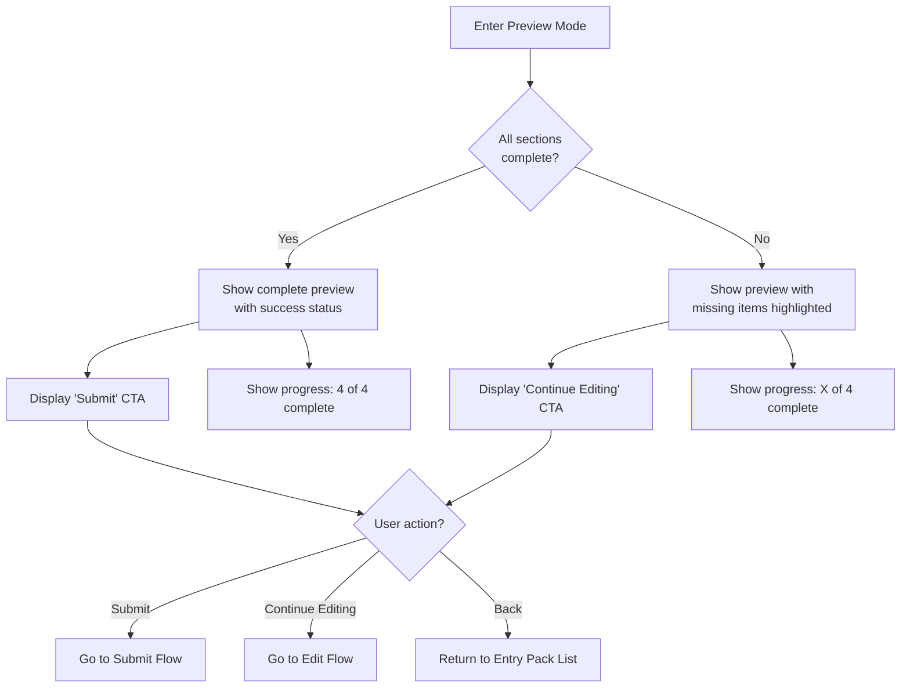
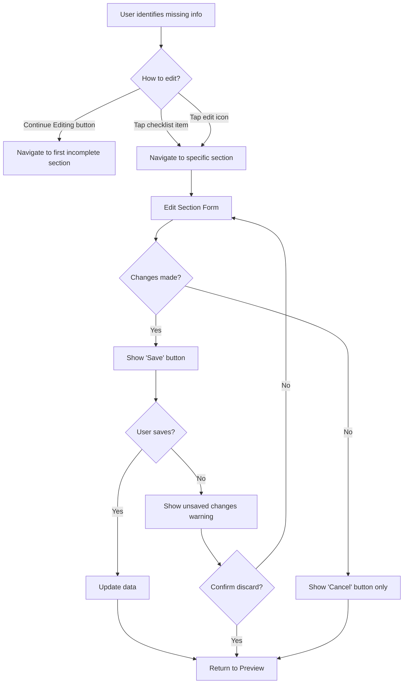
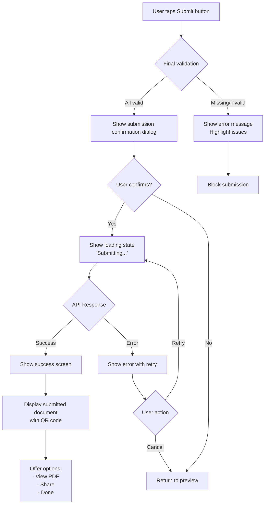

# TripSecretary TDAC Entry Pack Preview - UI/UX Specification

**Version:** 1.0
**Date:** 2025-10-29
**Author:** Sally (UX Expert)
**Status:** Ready for Development

---

## Table of Contents

1. [Introduction](#introduction)
2. [Overall UX Goals & Principles](#overall-ux-goals--principles)
3. [Information Architecture](#information-architecture)
4. [User Flows](#user-flows)
5. [Component Library](#component-library--design-system)
6. [Branding & Visual Design](#branding--visual-design-specifications)
7. [Responsiveness Strategy](#responsiveness-strategy)
8. [Accessibility Requirements](#accessibility-requirements)
9. [Animation & Micro-interactions](#animation--micro-interactions)
10. [Next Steps](#next-steps)

---

## Introduction

This document defines the user experience goals, information architecture, user flows, and visual design specifications for **TripSecretary's TDAC Entry Pack Preview** user interface. It serves as the foundation for visual design and frontend development, ensuring a cohesive and user-centered experience.

The TDAC Entry Pack Preview is a critical component of the travel documentation workflow, allowing users to review their Thailand Digital Arrival Card submission before finalizing. This specification focuses on reducing visual clutter, improving information hierarchy, and creating a calmer, more action-oriented experience.

### Document Purpose

- Provide developers with comprehensive implementation guidelines
- Establish design standards for the TDAC preview interface
- Ensure accessibility and responsive design from the start
- Create a cohesive user experience aligned with TripSecretary's brand

### Scope

This specification covers:
- The TDAC Entry Pack Preview screen redesign
- Supporting components and interactions
- Mobile-first responsive design (iOS & Android)
- Accessibility requirements (WCAG 2.1 AA)
- Animation and micro-interaction patterns

---

## Overall UX Goals & Principles

### Target User Personas

#### 1. International Traveler to Thailand
- **Age:** 25-65, mixed technical proficiency
- **Context:** Preparing for trip, may be stressed or time-constrained
- **Need:** Clear, error-free submission process without confusion
- **Pain Point:** Overwhelmed by dense information and unclear next steps

#### 2. First-Time TDAC User
- **Familiarity:** Low familiarity with Thai immigration processes
- **Requirement:** Clear guidance and reassurance
- **Emotion:** Anxious about making mistakes on official documents
- **Value:** Preview functionality to verify accuracy

#### 3. Repeat Traveler
- **Familiarity:** Familiar with the process, wants efficiency
- **Behavior:** Quickly scans for what's changed or needs attention
- **Frustration:** Unnecessary steps or visual noise
- **Goal:** Complete process quickly and accurately

### Usability Goals

1. **Clarity of Status:** Users can understand their submission status within 2 seconds of viewing
2. **Action Clarity:** Users know exactly what to do next (continue editing or submit)
3. **Error Prevention:** Missing or incorrect information is clearly highlighted before submission
4. **Cognitive Load Reduction:** Information presented in digestible chunks, not overwhelming walls of text
5. **Reassurance:** Preview mode clearly communicates "safe to review, not yet submitted"

### Design Principles

1. **Status First** - Always lead with current state and what's needed
2. **Progressive Disclosure** - Show only what's relevant for current step; hide complexity
3. **Calm by Default** - Use color sparingly; green only for actions, not backgrounds
4. **Trust Through Clarity** - Official documents deserve clean, professional presentation
5. **Guide, Don't Block** - Help users succeed rather than just preventing errors

---

## Information Architecture

### Screen Structure

The TDAC Entry Pack Preview exists within the TripSecretary app's entry pack management flow:

```mermaid
graph TD
    A[ชุดข้อมูลตรวจคนเข้าเมือง<br/>Entry Pack List] --> B[Entry Pack Preview]
    B --> C[TDAC Card Section]
    B --> D[Personal Info Section]
    B --> E[Travel Details Section]
    B --> F[Funds Section]
    C --> G[Edit TDAC Card]
    D --> H[Edit Personal Info]
    E --> I[Edit Travel Details]
    F --> J[Edit Funds]
    B --> K[Submit TDAC Entry Card]
```



### Navigation Structure

#### Primary Navigation
- Top app bar with back button (← ) to return to Entry Pack List
- Page title: "ชุดข้อมูลตรวจคนเข้าเมือง - ตัวอย่าง / Entry Pack Preview"
- Close button (×) to dismiss modal/screen

#### Secondary Navigation (Current Design)
- Horizontal tab navigation: ปัตร TDAC | ข้อมูลส่วนตัว | ข้อมูลการเดินทาง | เงินทุน
- Tabs: TDAC | Personal | Travel | Funds

#### Proposed Navigation (Redesign)
- Replace tabs with vertical progress stepper/checklist
- Shows completion status with visual indicators (✓, ⚠️, ○)
- Allows navigation by tapping on any step
- Reduces horizontal scrolling on mobile devices

#### Breadcrumb Strategy
Not applicable for mobile-first design. Top bar navigation sufficient for 2-level depth.

---

## User Flows

### Flow 1: View Entry Pack Preview

**User Goal:** Review all entry pack information before submission

**Entry Points:**
- "Preview" button from Entry Pack editing screen
- "View Details" from Entry Pack list
- Deep link from notification

**Success Criteria:** User can see complete preview, understand status, and identify any missing information

#### Flow Diagram



#### Edge Cases & Error Handling
- Preview opened before any data entered → Show empty state with "Start by adding TDAC card information"
- Network failure while loading preview → Show cached data with "Last updated" timestamp + retry option
- Preview opened while submission is in progress → Show loading state, prevent editing
- Preview accessed after successful submission → Show read-only view with "Submitted" badge

**Notes:** Preview is a safe, read-only mode by default. All CTAs should clearly indicate their purpose (editing vs. submitting).

---

### Flow 2: Edit Missing/Incorrect Information

**User Goal:** Add or correct information identified during preview review

**Entry Points:**
- "Continue Editing" button from preview
- Tap on specific incomplete section in checklist
- "Edit" icon next to any field in preview

**Success Criteria:** User can navigate to specific section, make changes, and return to preview

#### Flow Diagram



#### Edge Cases & Error Handling
- User tries to leave edit form with unsaved changes → Show confirmation dialog
- Validation error on save → Highlight specific field, show inline error, keep user on form
- Network error on save → Show error toast, cache changes locally, allow retry
- User navigates back without saving → Prompt "Discard changes?" with options

**Notes:** Maintain preview context so user knows they're in "preview → edit → back to preview" flow, not starting over.

---

### Flow 3: Submit Entry Pack

**User Goal:** Finalize and submit TDAC entry card for official processing

**Entry Points:**
- "Submit TDAC Entry Card" button from complete preview
- Pull-to-refresh gesture (if all complete)

**Success Criteria:** Submission succeeds, user receives confirmation, and can access submitted document

#### Flow Diagram



#### Edge Cases & Error Handling
- User has no internet during submission → Show offline error, queue for later submission with notification
- Submission times out → Show "Taking longer than expected" with option to wait or cancel
- User navigates away during submission → Continue in background, show notification on completion
- Duplicate submission attempted → API returns existing submission, show "Already submitted" with access to document
- Server validation fails after client validation passed → Show specific server errors, allow user to correct

**Notes:** This is the most critical flow - we need to be extra careful about error states and provide clear feedback at every step.

---

## Component Library / Design System

### Design System Approach

**Use existing:** TripSecretary's component library (React Native + Tamagui)
**Extend with:** New preview-specific components following existing patterns

---

### Core Components

#### Component 1: Preview Mode Badge

**Purpose:** Clearly indicate to user they're in preview mode, not editing mode

**Variants:**
- `preview` - Default state with eye icon
- `draft` - Indicates unsaved changes
- `readonly` - For submitted/locked previews

**States:**
- Default
- Dismissed (with option to restore via info icon)

**Visual Specs:**
```
┌─────────────────────────┐
│ 👁️ Preview Mode         │  Background: Light blue/gray (#F0F4F8)
│ ℹ️                       │  Border: 1px solid #D0D8E0
└─────────────────────────┘  Padding: 12px 16px
                              Border-radius: 8px
                              Position: Top of screen
```

**Usage Guidelines:**
- Always show at top of preview screen
- Dismissible with info icon that shows tooltip explanation
- On mobile, can collapse to chip after scroll to save space

---

#### Component 2: Status Card

**Purpose:** Primary focal point showing submission status and required actions

**Variants:**
- `incomplete` - Missing required information (Warning state)
- `complete` - Ready to submit (Success state)
- `submitted` - Already submitted (Info state)
- `error` - Submission failed (Error state)

**States:** Default only (status shown via variant)

**Visual Specs:**
```
┌─────────────────────────────────┐
│ ⚠️ Draft - Action Required      │  Background: White
│                                 │  Border: 2px solid (status color)
│ Missing:                        │  Shadow: elevation-2
│ • TDAC Entry Card               │  Padding: 16px
│                                 │  Border-radius: 12px
│ [📱 Add TDAC Card]             │
└─────────────────────────────────┘

Status Colors:
- Incomplete: #F59E0B (Amber)
- Complete: #10B981 (Green)
- Submitted: #3B82F6 (Blue)
- Error: #EF4444 (Red)
```

**Usage Guidelines:**
- Always visible above fold
- Action button appears inline based on status
- Missing items shown as bulleted list (max 3 visible, "+ X more" if needed)
- Icon changes based on status (⚠️, ✓, ℹ️, ✕)

---

#### Component 3: Progress Stepper (Vertical)

**Purpose:** Replace horizontal tabs with vertical progress indicator

**Variants:**
- `collapsed` - Shows only current section
- `expanded` - Shows all sections (default)

**States:**
- `completed` (✓ with green checkmark)
- `current` (⚠️ with amber indicator)
- `pending` (○ gray circle)
- `error` (✕ with red X)

**Visual Specs:**
```
┌─────────────────────────────┐
│ ✓ ข้อมูลส่วนตัว            │  Line height: 48px per item
│   Personal Information     │  Padding: 12px 16px
│                            │  Active: Bold + Indicator color
│ ⚠️ ปัตร TDAC ← You are here │  Inactive: Regular + Gray
│   TDAC Card                │  Connection line: 2px, left side
│                            │
│ ○ ข้อมูลการเดินทาง          │
│   Travel Details           │
│                            │
│ ○ เงินทุน                   │
│   Proof of Funds           │
└─────────────────────────────┘
```

**Usage Guidelines:**
- Replaces horizontal tab navigation
- Tappable to navigate between sections
- Auto-scrolls to current section on load
- Can collapse after first interaction to save vertical space
- Connection line visually links steps

---

#### Component 4: Document Preview Card

**Purpose:** Display preview of the TDAC card that will be generated

**Variants:**
- `sample` - Shows placeholder data
- `filled` - Shows actual user data
- `submitted` - Shows final submitted version with QR code

**States:**
- Default
- Loading (skeleton)
- Error (failed to generate preview)

**Visual Specs:**
```
┌─────────────────────────────────┐
│ 📄 TDAC Document Preview       │  Background: White
│                                 │  Border: 1px dashed #D0D8E0
│ [Document Preview Image]        │  Padding: 16px
│                                 │  Border-radius: 8px
│ Name: LAOLAO LI                 │
│ TDAC: A6A69EB                   │  Info badge at bottom
│ Passport: E1234567              │
│                                 │
│ ℹ️ Preview only - actual card   │
│ will include full details       │
└─────────────────────────────────┘
```

**Usage Guidelines:**
- Always shows info badge indicating preview status
- "Scroll to view all pages" prompt if multi-page
- Tappable to expand to full screen
- Loading state shows skeleton of document layout

---

#### Component 5: Action Button Group

**Purpose:** Primary and secondary CTAs for main user actions

**Variants:**
- `preview-incomplete` - Shows "Continue Editing" (primary)
- `preview-complete` - Shows "Submit Entry Pack" (primary) + "Continue Editing" (secondary)
- `submitted` - Shows "View PDF" / "Share" (secondary)

**States:**
- Default
- Loading (spinner in button)
- Disabled

**Visual Specs:**
```
Primary Button:
┌─────────────────────────────────┐
│   ส่งบัตรเข้าเมือง TDAC →       │  Background: #10B981 (Green)
│   Submit TDAC Entry Card        │  Color: White
└─────────────────────────────────┘  Height: 52px
                                      Border-radius: 12px
                                      Font: 16px, semibold

Secondary Button:
┌─────────────────────────────────┐
│   กลับไปกรอกข้อมูลเพิ่มเติม ✏️  │  Background: Transparent
│   Continue Editing              │  Border: 2px solid #10B981
└─────────────────────────────────┘  Color: #10B981
                                      Height: 52px
```

**Usage Guidelines:**
- Always fixed to bottom of screen for easy thumb access
- Primary button only appears when action is valid
- Secondary button uses outline style
- Spacing between buttons: 12px
- Buttons span full width minus 32px horizontal padding

---

#### Component 6: Info Alert

**Purpose:** Show important notices, warnings, or time-sensitive information

**Variants:**
- `info` - General information (blue)
- `warning` - Important notice (amber)
- `error` - Critical error (red)
- `success` - Confirmation (green)

**States:**
- Default
- Dismissible (with × button)

**Visual Specs:**
```
┌─────────────────────────────────┐
│ ℹ️  2 days remaining to submit  │  Background: Tint of status color
│                               × │  Border: 1px solid status color
└─────────────────────────────────┘  Padding: 12px 16px
                                      Border-radius: 8px
                                      Icon: Left-aligned, 20px
```

**Usage Guidelines:**
- Use sparingly to avoid alert fatigue
- Always include relevant icon
- Dismissible for non-critical info
- Action link optional (e.g., "Learn more")

---

## Branding & Visual Design Specifications

### Visual Identity

**Brand Guidelines:** TripSecretary existing brand system (see tamagui.config.ts)

**Design Philosophy for TDAC Preview:**
- **Calm professionalism** - Official government document context
- **Trust through clarity** - Clean, uncluttered interface
- **Bilingual harmony** - Thai and English text coexist without competition
- **Green as action** - Reserve green for CTAs only, not backgrounds

---

### Color Palette

| Color Type | Hex Code | Usage | Contrast Ratio |
|------------|----------|-------|----------------|
| **Primary** | `#10B981` | Submit button, success states, completed checkmarks | 4.5:1 on white |
| **Primary Light** | `#D1FAE5` | Success backgrounds, subtle highlights | N/A (background) |
| **Secondary** | `#3B82F6` | Info states, links, secondary actions | 4.5:1 on white |
| **Accent** | `#8B5CF6` | Special features, premium indicators | 4.5:1 on white |
| **Warning** | `#F59E0B` | Incomplete states, caution notices | 4.5:1 on white |
| **Warning Light** | `#FEF3C7` | Warning backgrounds | N/A (background) |
| **Error** | `#EF4444` | Errors, failed validations | 4.5:1 on white |
| **Error Light** | `#FEE2E2` | Error backgrounds | N/A (background) |
| **Success** | `#10B981` | Confirmations, positive feedback | 4.5:1 on white |
| **Neutral 900** | `#111827` | Primary text, headings | 16:1 on white |
| **Neutral 600** | `#4B5563` | Secondary text, descriptions | 7:1 on white |
| **Neutral 400** | `#9CA3AF` | Placeholder text, disabled states | 4.5:1 on white |
| **Neutral 200** | `#E5E7EB` | Borders, dividers | N/A (border) |
| **Neutral 100** | `#F3F4F6` | Backgrounds, cards | N/A (background) |
| **Neutral 50** | `#F9FAFB` | Page background | N/A (background) |
| **White** | `#FFFFFF` | Card backgrounds, buttons | N/A |

**Color Usage Guidelines:**
- **CRITICAL:** Green (#10B981) only for CTAs and positive confirmations - NOT for large backgrounds
- Use light tints (100-200) for large background areas
- Maintain 4.5:1 contrast ratio minimum for text
- Status colors (warning/error/success) should be immediately recognizable
- Neutral palette for 90% of interface, color for emphasis only

---

### Typography

#### Font Families
- **Thai:** `Sarabun` (Google Fonts) - Clean, modern, government-approved
- **English:** `Inter` (System fallback) - Professional, highly legible
- **Monospace:** `SF Mono` / `Consolas` - For document numbers, codes

#### Type Scale

| Element | Size | Weight | Line Height | Letter Spacing | Usage |
|---------|------|--------|-------------|----------------|-------|
| **H1** | 24px | 700 (Bold) | 32px | -0.02em | Page title |
| **H2** | 20px | 600 (Semibold) | 28px | -0.01em | Section headers |
| **H3** | 18px | 600 (Semibold) | 24px | 0 | Component titles |
| **Body** | 16px | 400 (Regular) | 24px | 0 | Primary content, Thai text |
| **Body Bold** | 16px | 600 (Semibold) | 24px | 0 | Emphasis, labels |
| **Small** | 14px | 400 (Regular) | 20px | 0 | Secondary info, captions |
| **Small Bold** | 14px | 600 (Semibold) | 20px | 0 | Labels, metadata |
| **Caption** | 12px | 400 (Regular) | 16px | 0.01em | Hints, footnotes |
| **Button** | 16px | 600 (Semibold) | 20px | 0 | Button text |

**Typography Guidelines:**
- **Bilingual Display:** Stack Thai above English, Thai in Body weight, English in Small
- **Hierarchy:** Use size + weight + color to establish importance
- **Line Length:** Maximum 70 characters per line for readability
- **Thai Text:** Never use letter-spacing (breaks Thai rendering)
- **Numbers:** Use tabular/monospace for alignment (passport numbers, TDAC IDs)

---

### Iconography

**Icon Library:** `@expo/vector-icons` (Feather icon set for outline style)

**Icon Sizes:**
- Small: 16px (inline with text)
- Medium: 20px (list items, input fields)
- Large: 24px (buttons, headers)
- XL: 32px (empty states, illustrations)

**Icon Style:**
- Outline style (not filled) for consistency
- 2px stroke weight
- Rounded line caps
- Single color (inherit from parent text color)

**Common Icons Used:**
- `eye` - Preview mode indicator
- `alert-triangle` - Warnings, incomplete states
- `check-circle` - Completed items
- `circle` - Pending items
- `x-circle` - Errors
- `edit-2` - Edit action
- `arrow-right` - Submit/next action
- `info` - Information tooltips
- `file-text` - Document preview
- `chevron-right` - Navigation

---

### Spacing & Layout

**Spacing Scale (8px base unit):**
```
xs:   4px   (0.5 unit) - Tight spacing within components
sm:   8px   (1 unit)   - Related items
md:   16px  (2 units)  - Standard component padding
lg:   24px  (3 units)  - Section spacing
xl:   32px  (4 units)  - Major section breaks
2xl:  48px  (6 units)  - Page-level spacing
3xl:  64px  (8 units)  - Hero sections
```

**Grid System:**
- **Container:** 100% width, max 1024px on desktop
- **Columns:** Single column on mobile, consider 2-column on tablet
- **Gutters:** 16px horizontal padding on mobile, 24px on tablet+
- **Safe Area:** Respect iOS/Android safe area insets

**Layout Principles:**
- **Mobile-first:** Design for 375px width (iPhone SE), scale up
- **Vertical rhythm:** Maintain consistent spacing using 8px grid
- **Card-based:** Group related content in elevated cards
- **Breathing room:** Don't crowd components - generous whitespace

**Component Spacing:**
```
Page Layout:
├── Safe Area Top (variable)
├── Header: 56px height
├── Spacing: lg (24px)
├── Preview Badge: auto height + md padding
├── Spacing: md (16px)
├── Status Card: auto height + md padding
├── Spacing: lg (24px)
├── Progress Stepper: auto height
├── Spacing: lg (24px)
├── Document Preview: auto height
├── Spacing: xl (32px)
├── Info Alerts: auto height (if present)
├── Spacing: 2xl (48px) [push buttons to bottom]
├── Action Buttons: 52px each + 12px gap
├── Spacing: lg (24px)
└── Safe Area Bottom (variable)
```

**Border Radius Scale:**
- Small: 4px - Input fields, chips
- Medium: 8px - Cards, alerts
- Large: 12px - Buttons, major cards
- Full: 9999px - Pills, badges

**Shadows/Elevation:**
```
elevation-1: 0 1px 3px rgba(0,0,0,0.1)   - Subtle lift
elevation-2: 0 4px 6px rgba(0,0,0,0.1)   - Cards, dropdowns
elevation-3: 0 10px 15px rgba(0,0,0,0.1) - Modals, overlays
elevation-4: 0 20px 25px rgba(0,0,0,0.15) - Drawer, bottom sheets
```

**Usage:**
- Status Card: elevation-2
- Document Preview: elevation-1
- Action Buttons: elevation-3 (when fixed)
- Alerts: No shadow (border instead)

---

## Responsiveness Strategy

### Platform & Device Context

**Primary Platform:** React Native (iOS & Android)
**Deployment:** Expo managed workflow
**Target Devices:** Smartphones (primary), Tablets (secondary)

### Breakpoints

| Breakpoint | Min Width | Max Width | Target Devices | Priority |
|------------|-----------|-----------|----------------|----------|
| **Mobile Small** | 320px | 374px | iPhone SE, small Android phones | High |
| **Mobile** | 375px | 767px | iPhone 12-15, standard Android | **Primary** |
| **Tablet** | 768px | 1023px | iPad, Android tablets | Medium |
| **Desktop** | 1024px | - | iPad Pro, large tablets | Low |

**Design Priority:** Mobile-first (375px baseline), progressively enhance for larger screens

---

### Adaptation Patterns

#### Layout Changes

**Mobile (375px - 767px):**
- Single column layout
- Vertical progress stepper
- Full-width components with 16px horizontal padding
- Status card + preview stack vertically
- Fixed action buttons at bottom

**Tablet (768px+):**
- Two-column layout option:
  - Left: Progress stepper (sticky)
  - Right: Status card + document preview
- Floating action buttons (bottom-right) instead of fixed full-width
- Increased horizontal padding to 32px
- Max content width: 1024px (centered)

**Orientation:**
- **Portrait (default):** Vertical scrolling, stacked layout
- **Landscape:** Consider horizontal split for tablets (stepper left, content right)
- **Mobile Landscape:** Collapse/minimize progress stepper, prioritize content

---

#### Navigation Changes

**Mobile:**
- Vertical progress stepper (expanded by default)
- Collapsible after first interaction to save space
- Bottom sheet for section navigation (swipe up)

**Tablet:**
- Persistent left sidebar with stepper
- Stepper always visible (doesn't collapse)
- Breadcrumbs in header for additional context

**Header:**
- Mobile: Single-line title, back button, close button
- Tablet: Full bilingual title visible, additional controls

---

#### Content Priority

**Mobile:**
1. Status card (hero)
2. Current incomplete item
3. Primary CTA
4. Progress stepper (collapsible)
5. Document preview (scroll below fold)

**Tablet:**
1. Status card + Progress stepper (side-by-side)
2. Document preview (larger, prominent)
3. Action buttons (floating, always visible)

**Progressive Disclosure:**
- Mobile: Show 3 missing items + "X more" link
- Tablet: Show up to 5 missing items
- Desktop: Show all missing items

---

#### Interaction Changes

**Touch Targets:**
- Mobile: Minimum 44x44px (iOS), 48x48px (Android)
- Tablet: Can reduce to 40x40px for secondary actions
- Generous padding around tappable areas

**Gestures:**
- Swipe between sections (mobile)
- Pull-to-refresh (all devices)
- Swipe-to-dismiss for alerts (mobile)
- Pinch-to-zoom on document preview (all devices)

**Text Input:**
- Mobile: Full-screen modal for editing (better keyboard UX)
- Tablet: Inline editing or side panel

---

### Platform-Specific Considerations

#### iOS
- Respect safe area insets (notch, home indicator)
- Use iOS-style modals (slide up from bottom)
- iOS-standard blur effects for overlays
- Haptic feedback on important actions
- Native date/time pickers

#### Android
- Respect system navigation (gesture/button)
- Material Design elevation system
- Android-standard bottom sheets
- Material ripple effects
- Native date/time pickers

#### Text Rendering
- Thai text: Ensure proper line breaking (no orphans)
- Bilingual: Stack Thai above English, adjust line-height
- Dynamic font size: Support iOS/Android accessibility settings
- Scale gracefully from 100% to 200% text size

---

### Performance Considerations

**Image Loading:**
- Lazy load document preview below fold
- Progressive image loading (blur-up effect)
- Optimize QR codes as SVG when possible

**Component Rendering:**
- Virtualized lists for long checklists (if >10 items)
- Memoize heavy components (document preview)
- Debounce scroll handlers

**Network:**
- Show cached preview while loading fresh data
- Optimistic UI updates for better perceived performance
- Offline mode: Show last cached state

---

## Accessibility Requirements

### Compliance Target

**Standard:** WCAG 2.1 Level AA + Mobile Accessibility Guidelines

**Legal Context:**
- Government document interface requires high accessibility standards
- Must support users with visual, motor, cognitive, and hearing disabilities
- Bilingual accessibility (Thai & English screen readers)

---

### Visual Accessibility

#### Color Contrast

**Minimum Requirements:**
- **Normal text (16px):** 4.5:1 contrast ratio
- **Large text (18px+ or 14px+ bold):** 3:1 contrast ratio
- **UI components:** 3:1 contrast against adjacent colors
- **Graphical objects:** 3:1 contrast (icons, charts)

**Implementation:**
- All text on white background: Use Neutral 900 (#111827) or darker
- Button text: White on Primary (#10B981) = 4.59:1 ✓
- Secondary text: Neutral 600 (#4B5563) = 7.21:1 ✓
- Status indicators: All chosen colors meet 4.5:1 minimum
- Never rely on color alone for information (use icons + text)

#### Focus Indicators

**Requirements:**
- Visible focus indicator on all interactive elements
- Minimum 2px outline, high-contrast color
- Focus order follows logical visual flow

**Implementation:**
```
Focus Style:
- Outline: 2px solid #3B82F6 (blue, not green to distinguish from success)
- Offset: 2px from element
- Border-radius: Match element + 2px
- Opacity: 100%
```

**Focus Order:**
1. Back button
2. Preview mode badge (if interactive)
3. Status card action button
4. Progress stepper items (top to bottom)
5. Document preview (tappable)
6. Info alerts (dismissible)
7. Continue editing button
8. Submit button

#### Text Sizing

**Requirements:**
- Support iOS/Android dynamic type
- Readable at 200% zoom without horizontal scrolling
- Maintain layout integrity at large text sizes

**Implementation:**
- Use relative units (sp on Android, points on iOS)
- Test at system settings: Default, Large, Extra Large
- Allow text to reflow, don't truncate critical information
- Min font size: 14px for body text (16px preferred)
- Buttons: Min height increases with text size

#### Visual Aids

- High contrast mode support (iOS/Android)
- Reduce transparency option (iOS)
- Support for system-level color filters/inversions
- No flashing content (seizure prevention)

---

### Motor Accessibility

#### Keyboard Navigation

**Requirements (for tablet/external keyboard):**
- All functionality available via keyboard
- Tab order logical and predictable
- No keyboard traps
- Skip navigation links

**Implementation:**
- Tab: Move focus forward through interactive elements
- Shift+Tab: Move focus backward
- Enter/Space: Activate buttons, checkboxes
- Arrow keys: Navigate within progress stepper
- Escape: Dismiss modals, alerts

#### Touch Targets

**Minimum Sizes:**
- iOS: 44x44pt (88x88px @2x)
- Android: 48x48dp
- Apply to: Buttons, links, stepper items, edit icons

**Spacing:**
- Minimum 8px between adjacent touch targets
- Action buttons separated by 12px vertically
- Don't cluster small interactive elements

#### Gestures

**Requirements:**
- All gestures have single-tap/button alternative
- No complex gestures required (pinch optional)
- Path-based gestures not required

**Implementation:**
- Swipe between sections → Also available via stepper tap
- Pull-to-refresh → Also available via refresh button
- Pinch-to-zoom document → Also available via tap-to-expand
- No shake gestures, no multi-finger required

---

### Screen Reader Support

#### iOS VoiceOver

**Requirements:**
- Meaningful labels for all elements
- Proper traits (button, header, link)
- Logical reading order
- Group related content

**Implementation Example:**
```jsx
<View accessible={true} accessibilityLabel="Status card">
  <View accessibilityRole="header">
    <Icon accessibilityLabel="Warning" />
    <Text>Draft - Action Required</Text>
  </View>
  <Text accessibilityLabel="Missing: TDAC Entry Card">
    Missing: TDAC Entry Card
  </Text>
  <Button
    accessibilityLabel="Add TDAC Card"
    accessibilityHint="Opens form to add your TDAC card information"
    accessibilityRole="button"
  >
    Add TDAC Card
  </Button>
</View>
```

**Key Labels:**
- Preview badge: "Preview mode. Your information has not been submitted yet."
- Status card: "Status: Draft - Action Required. Missing TDAC Entry Card."
- Progress stepper: "Step 1 of 4: Personal Information, completed. Step 2 of 4: TDAC Card, in progress. Current section."
- Document preview: "Preview of TDAC document. Tap to view full size."
- Submit button: "Submit TDAC Entry Card. Double tap to submit your entry pack for processing."

#### Android TalkBack

- Same requirements as VoiceOver
- Use `accessibilityLabel`, `accessibilityRole`, `accessibilityHint`
- Test with TalkBack enabled
- Ensure proper focus order

#### Bilingual Support

**Thai Screen Reader:**
- Provide Thai `accessibilityLabel` when `locale === 'th'`
- Use proper Thai pronunciation for acronyms (TDAC = "ที ดี เอ ซี")
- Don't rely on visual stacking for reading order

**English Screen Reader:**
- Clear, concise labels
- Avoid abbreviations without expansion
- Proper grammar for hints

---

### Cognitive Accessibility

#### Clear Language

- Simple, direct instructions
- Avoid jargon and complex terms
- Define acronyms on first use (TDAC = Thailand Digital Arrival Card)
- Error messages: Explain what's wrong AND how to fix it

#### Consistent Patterns

- Same actions work the same way throughout
- Predictable navigation
- Familiar UI patterns (standard buttons, checkboxes)
- Icons always paired with text labels

#### Error Prevention & Recovery

- Clear validation before submission
- Confirmation dialogs for destructive actions
- Undo options where possible
- Save progress automatically
- Clear path to correct errors

#### Reduced Complexity

- Progressive disclosure: Show only what's needed
- One primary action per screen
- Minimize cognitive load in preview mode
- Group related information visually

---

### Testing Strategy

#### Automated Testing

**Tools:**
- `@react-native-community/eslint-plugin-a11y` - Lint rules
- React Native Accessibility Inspector
- Axe DevTools Mobile (manual + automated)

**Checks:**
- Missing accessibility labels
- Insufficient color contrast
- Touch target size violations
- Proper semantic structure

#### Manual Testing

**Required Tests:**
1. **VoiceOver (iOS):**
   - Navigate entire preview flow
   - Verify all elements announced correctly
   - Test in Thai and English
   - Confirm logical reading order

2. **TalkBack (Android):**
   - Same tests as VoiceOver
   - Verify Android-specific behaviors
   - Test with different TalkBack speeds

3. **Keyboard (Tablet):**
   - Complete full flow with keyboard only
   - Verify focus indicators visible
   - Check no keyboard traps

4. **Dynamic Type:**
   - Test at 200% text size
   - Verify no content clipping
   - Check layout maintains usability

5. **Color Vision:**
   - Test with color blindness simulators
   - Verify information not color-only
   - Check icons + text patterns work

6. **Motor Impairments:**
   - Test with Switch Control (iOS) / Switch Access (Android)
   - Verify touch targets sufficiently large
   - Check button spacing adequate

#### User Testing

- Recruit users with disabilities for testing
- Include Thai-speaking users with accessibility needs
- Test on real devices, not just simulators
- Document and address findings

---

## Animation & Micro-interactions

### Motion Principles

**Design Philosophy:**
- **Purposeful, not decorative** - Every animation serves a functional purpose
- **Calm and professional** - Subtle motion that doesn't distract from official document context
- **Respect user preferences** - Honor system "reduce motion" settings
- **Performance-first** - Smooth 60fps animations, never janky
- **Enhance understanding** - Motion clarifies relationships and state changes

**Core Principles:**

1. **Immediate Feedback** - User actions trigger instant visual response (<100ms)
2. **Natural Motion** - Use easing that mimics real-world physics
3. **Purposeful Duration** - Fast enough to feel responsive (200-300ms), slow enough to be understood
4. **Reduce Motion Support** - Provide alternative feedback for users with motion sensitivity
5. **Layer Hierarchy** - Elements closer to user move faster/more than background elements

---

### Key Animations

#### 1. Page Transition (Enter Preview)
- **Duration:** 300ms
- **Easing:** `easeOutCubic`
- **Behavior:** Slide in from right (iOS) or fade + scale (Android)
- **Reduced Motion:** Cross-fade only (200ms)

```jsx
// React Native Reanimated
{
  transform: [{
    translateX: withTiming(0, {
      duration: 300,
      easing: Easing.bezier(0.33, 1, 0.68, 1)
    })
  }],
  opacity: withTiming(1, { duration: 300 })
}
```

#### 2. Status Card Appearance
- **Duration:** 400ms (staggered)
- **Easing:** `easeOutBack` (slight bounce)
- **Behavior:** Fade in + scale from 0.95 to 1.0
- **Delay:** 100ms after page loads
- **Reduced Motion:** Fade in only

#### 3. Progress Stepper Updates
- **Duration:** 250ms
- **Easing:** `easeInOutQuad`
- **Behavior:**
  - Icon change (circle → checkmark): Scale pulse (0.8 → 1.2 → 1.0)
  - Color change: Fade between states
  - Connection line: Grow from top to bottom
- **Reduced Motion:** Instant color change only

```jsx
// Checkmark completion
{
  scale: withSequence(
    withTiming(0.8, { duration: 100 }),
    withTiming(1.2, { duration: 150 }),
    withTiming(1.0, { duration: 100 })
  )
}
```

#### 4. Button Press
- **Duration:** 150ms press, 100ms release
- **Easing:** `easeInOut`
- **Behavior:**
  - Scale: 1.0 → 0.97 (press) → 1.0 (release)
  - Opacity: 1.0 → 0.8 (press) → 1.0 (release)
  - Ripple effect (Android): Material Design standard
- **Haptic:** Light impact on press (iOS), soft vibration (Android)
- **Reduced Motion:** Opacity change only

#### 5. Alert/Banner Appearance
- **Duration:** 350ms
- **Easing:** `easeOutQuint`
- **Behavior:** Slide down from top + fade in
- **Reduced Motion:** Fade in only (250ms)

```jsx
{
  translateY: withTiming(0, {
    duration: 350,
    easing: Easing.bezier(0.22, 1, 0.36, 1)
  }),
  opacity: withTiming(1, { duration: 350 })
}
```

#### 6. Alert Dismissal
- **Duration:** 200ms
- **Easing:** `easeInQuad`
- **Behavior:** Slide up + fade out
- **Reduced Motion:** Fade out only (150ms)

#### 7. Document Preview Expand
- **Duration:** 300ms
- **Easing:** `easeInOutCubic`
- **Behavior:**
  - Scale from current position to fullscreen
  - Background overlay fade in (0 → 0.9 opacity)
  - Border radius: 8px → 0px
- **Reduced Motion:** Instant fullscreen with fade transition

#### 8. Loading States
- **Duration:** Infinite loop
- **Easing:** `linear` (for rotation)
- **Behavior:**
  - Spinner: 360° rotation, 800ms per revolution
  - Skeleton: Shimmer effect left-to-right, 1.5s duration
- **Reduced Motion:** Static pulse (opacity 0.5 → 1.0 → 0.5, 2s)

#### 9. Error Shake
- **Duration:** 400ms
- **Easing:** `easeInOutQuad`
- **Behavior:** Horizontal shake (0 → -10px → 10px → -5px → 5px → 0)
- **Use Case:** Form validation error, invalid submission attempt
- **Reduced Motion:** Red border pulse only

```jsx
// Shake animation
{
  translateX: withSequence(
    withTiming(-10, { duration: 80 }),
    withTiming(10, { duration: 80 }),
    withTiming(-5, { duration: 80 }),
    withTiming(5, { duration: 80 }),
    withTiming(0, { duration: 80 })
  )
}
```

#### 10. Submit Success Celebration
- **Duration:** 600ms
- **Easing:** `easeOutBack`
- **Behavior:**
  - Checkmark icon: Scale from 0 → 1.3 → 1.0 with rotation
  - Confetti particles (optional, subtle)
  - Success message: Fade in + slide up
- **Haptic:** Success notification (iOS), longer vibration (Android)
- **Reduced Motion:** Fade in only, no particles

---

### Micro-interactions

#### Button Hover (Tablet/Desktop)
- **Visual:** Background color darkens by 10%
- **Duration:** 150ms
- **Cursor:** Changes to pointer
- **No effect on mobile**

#### Input Focus
- **Visual:** Border color changes to Primary blue
- **Duration:** 200ms
- **Additional:** Border width 1px → 2px

#### Checkbox/Radio Selection
- **Visual:** Checkmark/dot appears with scale animation
- **Duration:** 200ms
- **Easing:** `easeOutBack`
- **Haptic:** Selection feedback (light impact)

#### Tab Navigation (If Used)
- **Visual:** Underline slides from previous to new tab
- **Duration:** 250ms
- **Easing:** `easeInOutQuad`

#### Pull-to-Refresh
- **Visual:** Spinner appears with scale, rotates while loading
- **Duration:** Spinner appears in 200ms, rotation continuous
- **Haptic:** Start/end feedback

#### Swipe Gesture Feedback
- **Visual:** Element translates with finger, rubber band at limits
- **Duration:** Follows finger (no fixed duration)
- **Release:** Snap animation 300ms

---

### Accessibility & Performance

#### Reduced Motion Support

```jsx
import { AccessibilityInfo } from 'react-native';

const [reduceMotion, setReduceMotion] = useState(false);

useEffect(() => {
  AccessibilityInfo.isReduceMotionEnabled().then(enabled => {
    setReduceMotion(enabled);
  });
}, []);

// Conditionally apply animations
const animationConfig = reduceMotion
  ? { duration: 0 } // Or simple fade
  : { duration: 300, easing: Easing.bezier(...) };
```

#### Performance Optimization

**Best Practices:**
- Use `react-native-reanimated` for complex animations (runs on native thread)
- Avoid animating layout properties (width, height) - use transform instead
- Use `useNativeDriver: true` when possible
- Batch multiple animations in single frame
- Memoize animated values to prevent recalculation

**Performance Budget:**
- All animations must maintain 60fps on iPhone 8/Android equivalent
- Loading animations should not block UI thread
- Skeleton screens preferred over spinners for better perceived performance

#### Testing Animations

**Required Tests:**
1. Enable "Reduce Motion" and verify fallback animations work
2. Test on low-end devices (ensure 60fps)
3. Verify haptic feedback works on supported devices
4. Check animation timing feels consistent across iOS/Android
5. Ensure no animation jank during data loading

---

### Animation System Architecture

**Recommended Implementation:**

```jsx
// Animation timing constants
export const ANIMATION_DURATION = {
  INSTANT: 0,
  FAST: 150,
  NORMAL: 250,
  SLOW: 400,
  VERY_SLOW: 600,
};

export const ANIMATION_EASING = {
  LINEAR: Easing.linear,
  EASE_IN: Easing.bezier(0.42, 0, 1, 1),
  EASE_OUT: Easing.bezier(0, 0, 0.58, 1),
  EASE_IN_OUT: Easing.bezier(0.42, 0, 0.58, 1),
  EASE_OUT_BACK: Easing.bezier(0.34, 1.56, 0.64, 1),
};

// Centralized animation configs
export const ANIMATIONS = {
  pageTransition: {
    duration: ANIMATION_DURATION.NORMAL,
    easing: ANIMATION_EASING.EASE_OUT,
  },
  buttonPress: {
    duration: ANIMATION_DURATION.FAST,
    easing: ANIMATION_EASING.EASE_IN_OUT,
  },
  // ... etc
};
```

---

## Next Steps

### Immediate Actions

1. **Developer Review** - Full stack developer reviews specification and asks clarifying questions
2. **Component Audit** - Verify existing Tamagui components can be reused/extended
3. **Prototype Key Flows** - Build clickable prototype for user testing
4. **Create Design Files** - If detailed mockups needed in Figma/Sketch
5. **Accessibility Audit** - Review current implementation against requirements
6. **Performance Baseline** - Measure current performance metrics

### Design Handoff Checklist

- [x] All user flows documented
- [x] Component inventory complete
- [x] Accessibility requirements defined
- [x] Responsive strategy clear
- [x] Brand guidelines incorporated
- [x] Performance goals established
- [ ] Design files created (if needed)
- [ ] Developer questions answered
- [ ] Implementation plan approved

### Development Recommendations

1. **Phase 1: Foundation**
   - Set up component library extensions
   - Implement design tokens (colors, spacing, typography)
   - Create base components (Status Card, Progress Stepper)

2. **Phase 2: Core Features**
   - Implement preview mode layout
   - Build user flows (view, edit, submit)
   - Add animations and micro-interactions

3. **Phase 3: Polish**
   - Accessibility implementation and testing
   - Performance optimization
   - Cross-platform testing (iOS/Android)

4. **Phase 4: Validation**
   - User testing with real travelers
   - A/B testing (if applicable)
   - Analytics implementation

### Open Questions

- Is there existing analytics on device usage (mobile vs tablet)?
- What's the current error rate on TDAC submissions?
- Are there specific Thai accessibility resources/guidelines to follow?
- What's the backend API response time for submission?
- Are there any legal requirements for document preview presentation?

---

## Change Log

| Date | Version | Description | Author |
|------|---------|-------------|--------|
| 2025-10-29 | 1.0 | Initial specification created for TDAC Entry Pack Preview redesign | Sally (UX Expert) |

---

**End of Specification**

For questions or clarifications, contact the UX team or refer to:
- TripSecretary design system: `tamagui.config.ts`
- Architecture docs: `docs/architecture/`
- PRD: `docs/prd.md`
